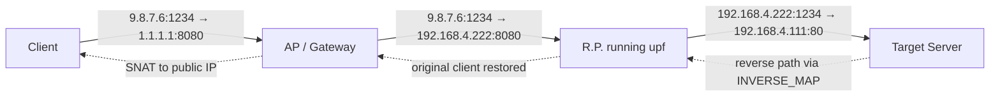

# port-forwarding

> A high-performance, in-kernel port forwarder built with Rust and eBPF/XDP, with a real-time terminal UI for live operation.

Packets are inspected, rewritten, and forwarded **inside the kernel's XDP layer** — never copied to userspace. The companion userspace program is a Ratatui-based terminal UI that lets an operator add, remove, and observe forwarding rules while live traffic flows.

This project demonstrates a complete data-plane / control-plane split that mirrors how production network functions (CGNAT, load balancers, 5G UPFs) are built.

---

## Highlights

- **Full XDP data path** — Ethernet/IPv4/TCP parsing, header rewriting, and incremental checksum updates done inside the kernel, with the eBPF verifier as the safety net.
- **Bidirectional NAT** — forward path rewrites destination, reverse path restores the original client view via an LRU session map.
- **Lock-free userspace** — the TUI and the rule-management worker run as separate concurrency contexts, communicating only through `mpsc` channels. eBPF maps are owned by exactly one of them, eliminating shared-mutable state.
- **Live operator UI** — a three-panel terminal interface (network status, active rules, shell) built on Ratatui, with Tab autocompletion driven by a command tree.
- **Verifier-aware code** — every packet pointer goes through a single `ptr_at` helper that performs the bounds check the verifier requires; checksum folding is unrolled rather than looped, because the verifier rejects unbounded loops.

---

## Architecture


The system has two halves that communicate through eBPF maps and channels.

**Kernel side (XDP program, `port-forwarding-ebpf`).** A single XDP program attached to a network interface inspects every incoming packet. For each packet it runs `verify_headers` to validate the L2/L3/L4 stack, then either rewrites and re-transmits the packet (`XDP_TX`) or passes it up to the kernel network stack (`XDP_PASS`). All rule lookups, session tracking, and statistics are performed against eBPF maps shared with userspace.

**Userspace side (`port-forwarding`).** A Tokio runtime drives the TUI loop, while a dedicated `std::thread` worker owns the `RULES` map. Userspace events flow as follows:

1. The user types a command into the Shell panel (e.g. `add 192.168.4.111 8080`).
2. The TUI parses it through a hierarchical command tree and sends a typed `ControlMessage` over an `mpsc` channel to the worker.
3. The worker mutates the `RULES` map and replies with a `WorkerResponse` so the TUI can update the Active Rules panel.
4. Independently, the TUI polls `IFACE_STATS` once per second to refresh the Network Status panel.

The TUI never touches `RULES` directly, and the worker never touches `IFACE_STATS`. There are no `Mutex` or `RwLock` instances anywhere in userspace — concurrency is enforced purely by ownership.

---

## Packet Flow



The forward path performs both SNAT (source = our IP) and DNAT (destination = the rule's target IP and port) before re-transmitting the packet on the same interface. The reverse path uses the `INVERSE_MAP` LRU session table to recover the original client address and undo the rewrite.

---

## Repository Layout

```
.
├── port-forwarding-common/         # Shared structs between user and kernel
│   └── src/lib.rs                  #   ForwardRule, GlobalConfig, InterfaceState, SessionKey
├── port-forwarding-ebpf/           # Kernel XDP program (no_std)
│   └── src/
│       ├── main.rs                 #   XDP entry, try_port_forwarding, try_restore_response
│       ├── verify.rs               #   Header parsing and ptr_at bounds-check helper
│       ├── cksum.rs                #   Incremental IP/TCP checksum (verifier-friendly, unrolled)
│       └── ether.rs                #   Ethernet header rewrite (per-byte to dodge memcpy issues)
├── port-forwarding/                # Userspace binary
│   └── src/
│       ├── main.rs                 #   eBPF loader, TUI loop, worker thread, channels
│       └── cli/
│           ├── command.rs          #   Command tree definition (data only)
│           └── commands_node.rs    #   Tree builder, executor, Tab suggestions
└── docs/
    └── diagrams/architecture.svg
```

---

## Quick Start

### Prerequisites

- Linux kernel 5.10+ with XDP support
- Rust nightly (eBPF build target)
- `bpf-linker` and the `bpfel-unknown-none` target installed
- Root privileges (XDP programs require `CAP_BPF` / `CAP_NET_ADMIN`)

### Build

```bash
cargo xtask build-ebpf --release
cargo build --release
```

### Configure

Create a `.env` file with the MAC and IP information used to rewrite packets at egress:

```dotenv
GW_MAC=aa:bb:cc:dd:ee:ff   # Default gateway MAC
MY_MAC=11:22:33:44:55:66   # This machine's NIC MAC
MY_IP=192.168.4.222        # This machine's IP
```

### Run

```bash
sudo ./target/release/port-forwarding -i <interface>
```

The TUI takes over the terminal. Use the Shell panel to manage rules:

```
> add 192.168.4.111 8080      # Forward incoming :8080 to 192.168.4.111:8080
  ok: ADD rule 192.168.4.111:8080
> show                        # List active rules
  active rules (1):
    8080 -> 192.168.4.111:8080  (12 pkts)
> remove 8080                 # Tear down the rule
> quit
```

`Tab` shows context-aware suggestions; `Esc` or `Ctrl+C` exits cleanly.

---

## Engineering Highlights

### Verifier-First Coding

The Linux eBPF verifier rejects programs whose memory safety it cannot prove. Several non-obvious patterns in this codebase exist solely to keep the verifier happy:

- **All packet pointers go through `ptr_at`.** Casting `ctx.data() as *mut EthHdr` directly produces a pointer with a "readable region" of zero, even though the bytes are physically present. The verifier blocks any access through such a pointer. `ptr_at` performs the canonical bounds check (`start + offset + size_of::<T>() > end`) and yields a pointer the verifier knows is safe to dereference.

- **Checksum folding is loop-free.** A natural one's-complement fold is `while sum >> 16 != 0 { sum = (sum & 0xffff) + (sum >> 16); }`. The verifier cannot prove this terminates within its instruction budget and rejects the program. The implementation here unrolls two passes — provably sufficient for any 32-bit input — and reads as straight-line code.

- **Ethernet header rewriting is per-byte.** A six-byte assignment like `eth.src_addr = config.my_mac;` compiles to a `memcpy` call between a map-value pointer and a packet pointer. The verifier rejects this often because it cannot independently track both regions across the call. Writing each byte explicitly produces six individual stores whose offsets the verifier verifies trivially.

These are documented in code comments so future contributors don't reintroduce the rejected patterns.

### Map Ownership for Lock-Free Concurrency

eBPF maps in `aya` can be borrowed (`map_mut`) or moved (`take_map`). Once a map is taken, the userspace handle is the sole owner. This codebase exploits that to give different concurrency contexts non-overlapping map ownership:

| Map | Owner | Access pattern |
|-----|-------|---------------|
| `IFACE_STATS` | TUI (Tokio task) | 1s polling read |
| `RULES` | Worker (`std::thread`) | Mutated on `ControlMessage` |
| `INVERSE_MAP` | Kernel only | LRU eviction handled by kernel |
| `CONFIG` | Set once at startup | Read-only afterwards |

No `Arc<Mutex<...>>`, no `RwLock`, no atomic counters in userspace. The compiler's borrow checker, plus channel-based message passing, is sufficient.

### TUI Architecture

The TUI follows the immediate-mode pattern. The `ui()` function is pure — it consumes `&App` and renders. State changes happen elsewhere, in three places:

- Keyboard events update `app.input`, push lines to `app.shell_lines`, and dispatch commands.
- A 1-second tick reads `IFACE_STATS` into `app.stats_lines` and asks the worker for a rules snapshot.
- A 50 ms tick drains the worker response channel and updates `app.rules_lines`.

The Shell panel renders both the scrollback and the live input as a single `Paragraph` whose last line is `> {input}`. This keeps the user's command and its output visually adjacent — important for an interactive operator UI.

### Command Tree with Tab Completion

Commands are defined as flat data in `cli/command.rs` (parent name, depth, argument type, optional action) and assembled into a tree at startup. The same tree drives both execution (`execute_command`) and Tab suggestions (`suggest_next_commands`), so adding a new command means adding a row to the data — no parser to update.

---

## Known Limitations

This is an actively evolving codebase. Current limitations, with planned mitigations:

| Area | Limitation | Plan |
|------|-----------|------|
| Reverse path | Restored source IP is hardcoded; `tcp.source` is restored to a hardcoded `80` rather than the rule's listen port | Phase 1 cleanup — derive both from `RULES` |
| Rule shape | The same port is used as both the listen port and the target port | Extend `ControlMessage::AddRule` to carry both, syntax `add <listen> <target_ip> <target_port>` |
| Counters | `IFACE_STATS` is a normal `HashMap`, so per-CPU updates can lose increments at high load | Switch to `PerCpuHashMap`, sum in userspace |
| Interface | Single-interface only (one XDP attach point) | Plan to support a second NIC (USB Ethernet on Raspberry Pi) for true two-arm routing |
| Protocol | IPv4 + TCP only | UDP is a small extension; IPv6 is a meaningful addition |
| Persistence | Rules are lost on restart | Snapshot `RULES` to disk on shutdown, replay on startup |

---

## Tech Stack

- **Rust** (stable userspace, nightly for eBPF target)
- **aya** (eBPF loader and bindings)
- **Tokio** (async runtime for the TUI)
- **Ratatui** + **crossterm** (terminal UI)
- **clap**, **dotenvy**, **anyhow**, **log** / **env_logger**

---

## License

Dual MIT / GPL — same as the kernel-side code's license declaration in the eBPF object.
